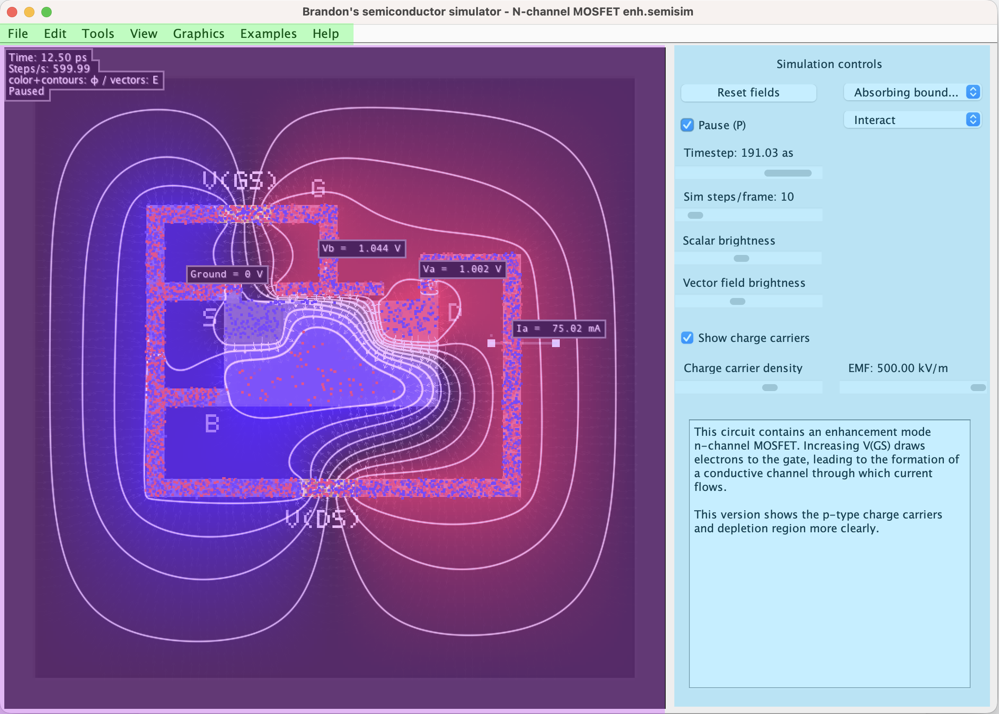
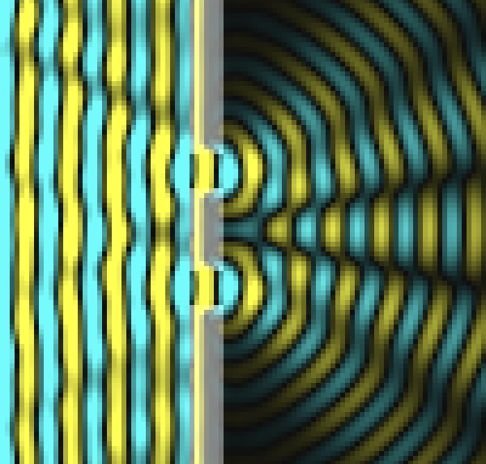
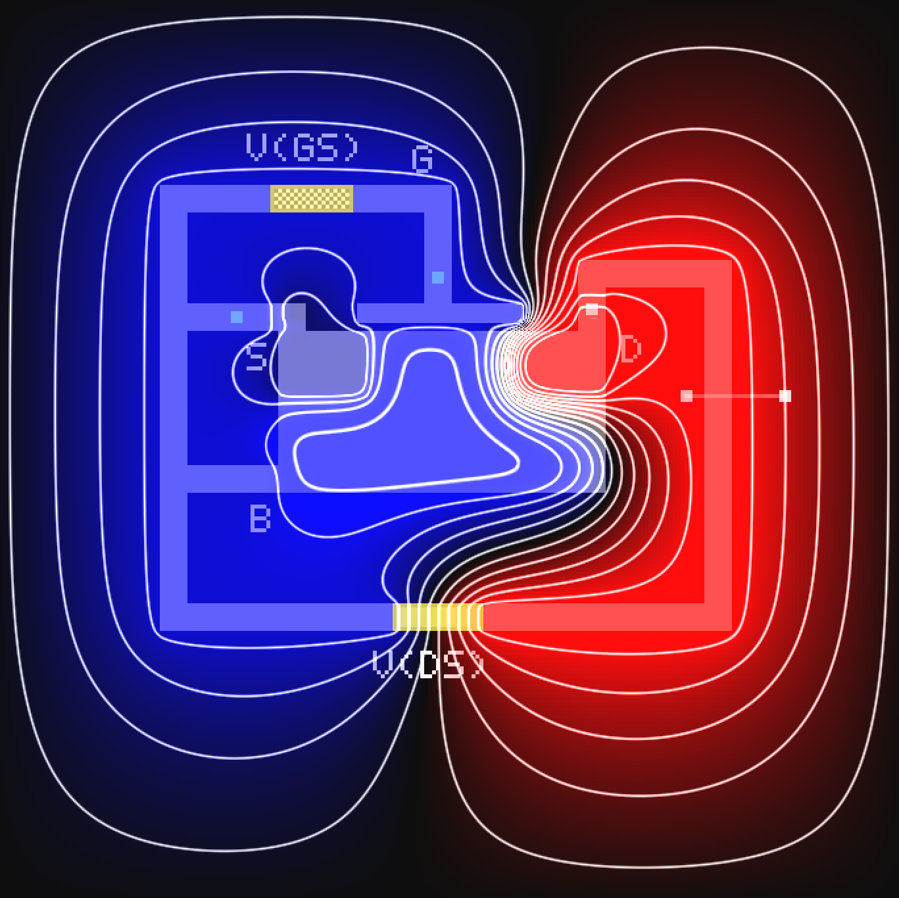
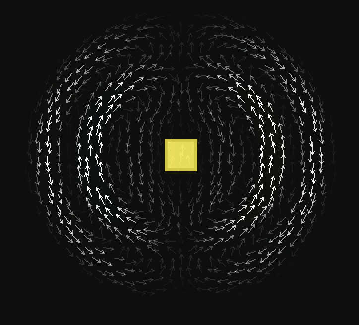
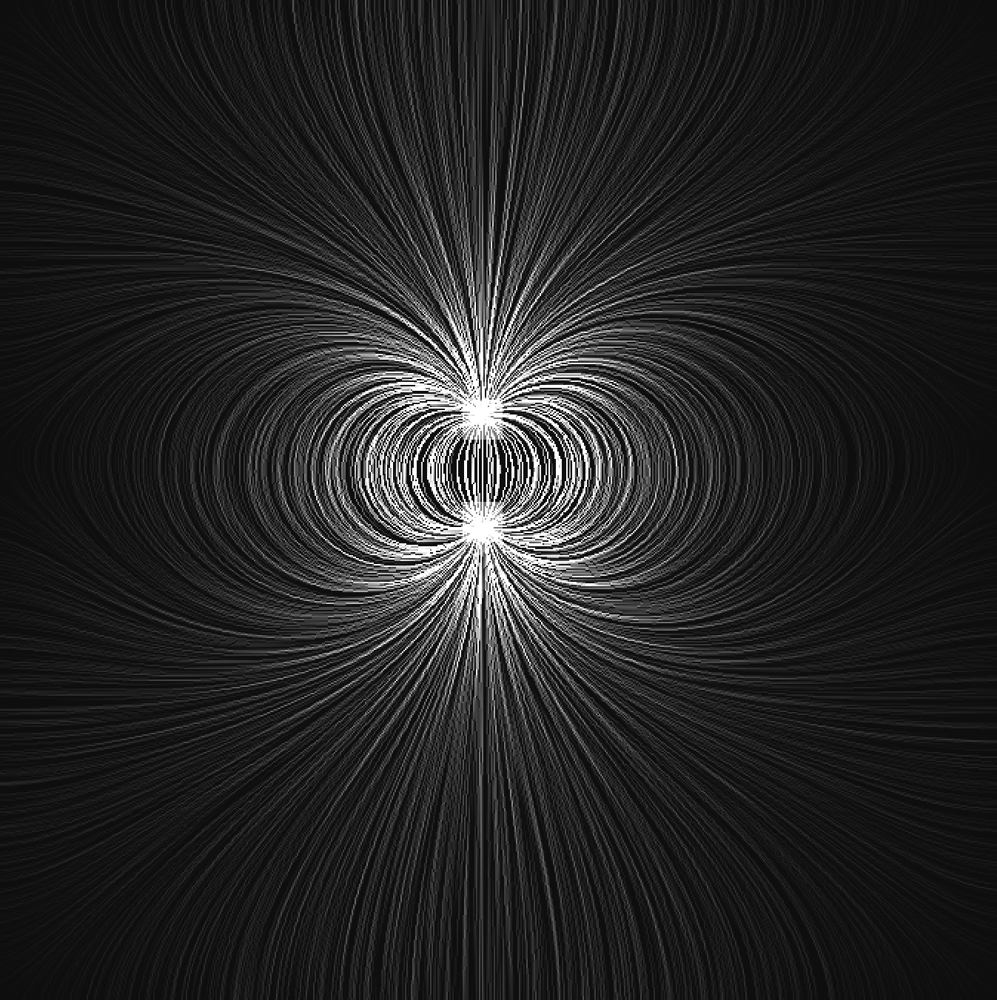
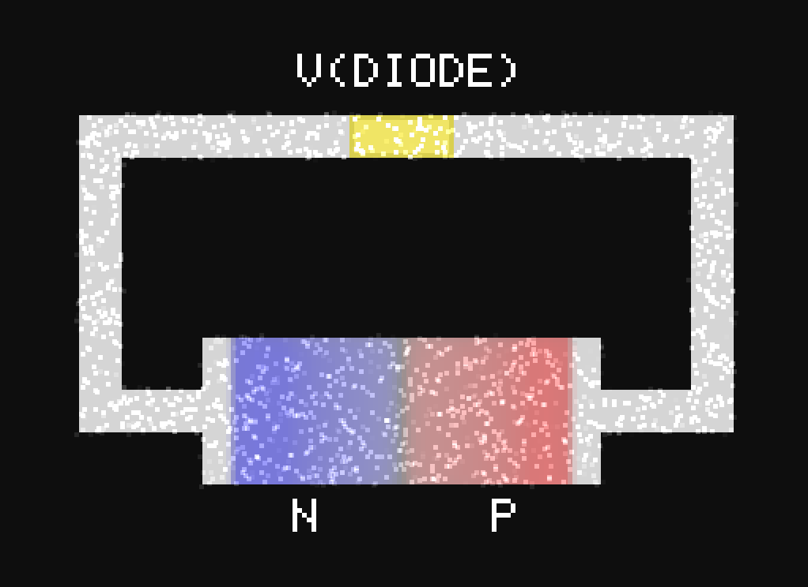
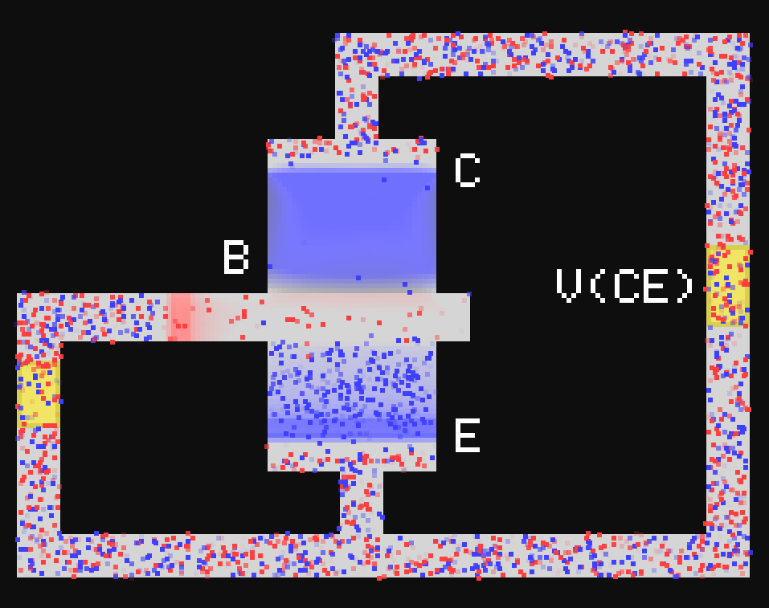
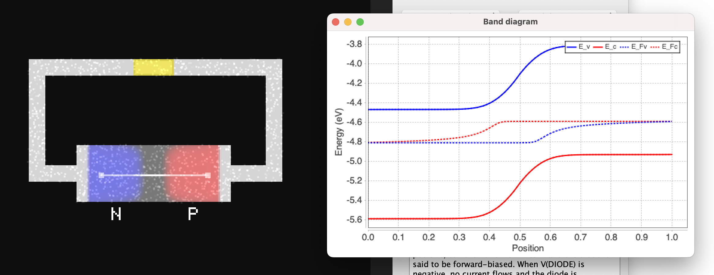
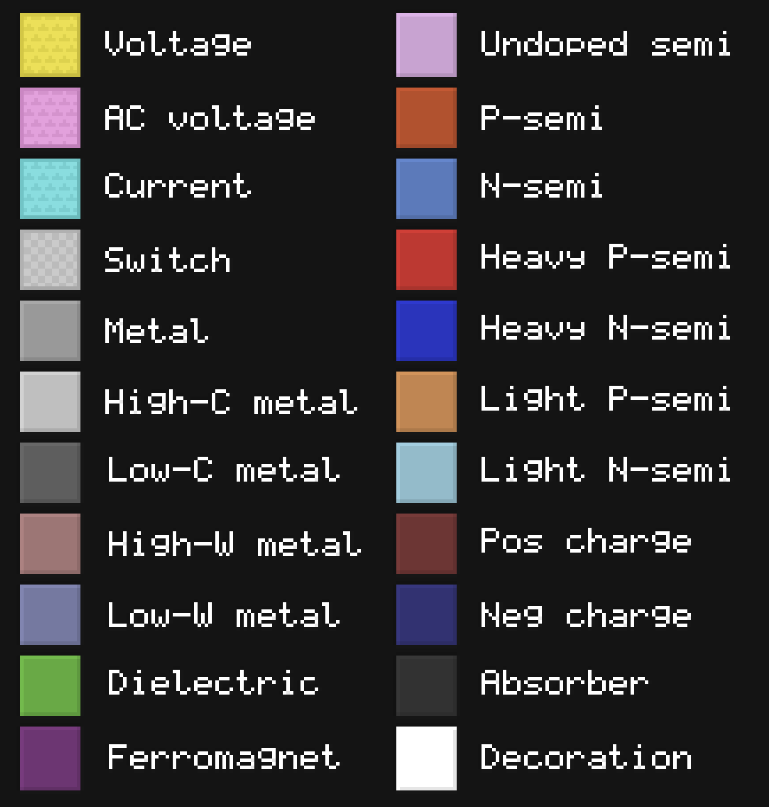

# Installation Instructions and Troubleshooting

## Installation

1.  Make sure you have the latest version of Java installed. Java can be found [here](https://www.java.com/en/download/manual.jsp).
2.  Extract the contents of SemiSim.zip into a new folder.
3.  Double click SemiSim.jar to run it.
4.  If SemiSim crashes when loading a file:
    *   Make sure you have a 64-bit version of Java installed.

## Mac OS

1.  If you see "_SemiSim.jar cannot be opened because it is from an unidentified developer_":
    *   Right click "SemiSim.jar" and click "Open".
    *   Click "Open" again on the popup window.
2.  If you are unable to see and open files:
    *   Go into System Preferences → Security → Privacy → Full Disk Access.
    *   Add "/System/Library/CoreServices/Jar Launcher.app" to the list and give it disk access.

# Introduction

Brandon's semiconductor simulator (SemiSim) is an educational tool made with the original purpose of helping its creator understand semiconductor devices. It is fully interactive, letting users draw circuits and create their own devices in a manner similar to painting software. There is a wide variety of different materials to choose from and many ways to visualize the electromagnetic phenomena associated with semiconductors. Users can either load one of the many premade simulations or create their own.

## Physics

The simulation is set on a two-dimensional grid over which it solves the 2D Maxwell equations. The electric field lies in the same plane as the surface of the screen whereas the magnetic field is perpendicular to it. On top of this, there are two types of charge carriers, electrons and holes, which feel electric and chemical forces that determine their dynamics. The simulation uses a FDTD (finite-difference time domain) scheme obtained by discretizing the Maxwell equations and the drift-diffusion equations and coupling the two together. This results in a simulation that demonstrates many of the important properties of semiconductors and semiconductor devices, such as:

*   PN junctions
*   Metal-semiconductor junctions
*   Thermoelectricity
*   Contact potentials
*   Heterojunctions
*   Simulation of common semiconductor devices, eg. BJTs, MOSFETs, JFETs, diodes, etc.

Since version 2.0, the simulation also supports the following:

*   Velocity saturation
*   Radiative, trap-assisted, and auger recombination
*   User-defined materials

## Limitations

Because the simulation uses a very simplified model of how semiconductors work, it is not able capture some phenomena that show up in real systems. Things that the simulation cannot handle include:

*   Quantum tunnelling
*   Surface states (Eg. fermi level pinning, surface recombination) \*
*   Ballistic conduction
*   Electrical breakdown \*
*   Metallic band structures
*   Hall effect \*

The default semiconductor material is designed to showcase the general behavior of semiconductors but does not, however, correspond to an existing substance. In version 2.0, the simulation comes with models of real materials that can be accessed via the advanced settings menu. These predefined materials are Si, Ge, GaAs and GaN.  
  
\* These could be implemented straightforwardly if there is interest.

# Simulation features

The interface consists of the simulation area which the user can interact with, simulation controls that allow various parameters to be adjusted, and a menu bar containing different settings and tools.



Simulation area (purple), controls (blue), and menu bar (green).

The main way to interact with circuits is through voltage sources and switches. A good way to get started with this software is to load one of the many examples.

## View options

**Colors:** The value of a field is mapped to a color.



**Contour:** Contour lines indicate a region on which the scalar field has a constant value.



**Arrows:** The direction and brightness of arrows corresponds to the direction and magnitude of the vector field.



**Lines:** The brightness and density of lines indicates the magnitude of the field.



**Dots:** The velocity of the dots is proportional to the value of the vector field.



**Charge carriers:** Electrons and holes are represented as blue and red dots, respectively. Both dots move at the actual drift velocities of their corresponding charge carriers and their density accurately reflects the density of charge carriers. White and black dots represent carrier recombination and generation events.



## Options

|     |     |
| --- | --- |
| Boundary condition | Choose between a boundary that absorbs outgoing radiation or a perfectly conductive boundary that reflects it. |
| Timestep | Sets the simulation timestep. The maximum timestep is determined by the CFL condition for the wave equation and diffusion equations for each charge carrier. |
| Sim steps/frame | Sets the number of iterations performed during each frame. Most of the examples require at least 10 steps/frame to run responsively. The maximum number depends on how good the user's computer is. |
| Reset fields | Sets all fields to their default values, leaving the materials unchanged. |
| Preferences | Contains options for display size, units, and other software settings. |
| Simulation settings | Contains settings for simulation domain size, physical constants, and material properties. |
| Custom materials | Allows user to add their own materials. |
| Material viewer | Displays data for every material such as dielectric constant, conductivity, etc. |

## Tools

|     |     |
| --- | --- |
| Interact | Allows user to control voltage sources and turn switches on and off by clicking. |
| Flashlight | Shines a light on the region under the cursor, creating pairs of electrons and holes. |
| Zoom and Pan | Click and drag to zoom into a region. Click to zoom out. Hold shift (or middle mouse) to pan. |
| Draw | Adds material to the field. |
| Replace | Similar to the draw tool, but overwrites occupied areas. |
| Line | Draws a line of material. |
| Fill | Fills a region with a certain material, similar to the bucket tool. |
| Eraser | Erases material. |
| Select and Move | Makes a rectangular selection which can be dragged around and moved. |
| Flood select | Selects a contiguous region, similar to the bucket tool. |
| Text | Place a text cursor allowing text to be typed on the screen. |
| Voltage probe | Adds a voltage probe that measures electrochemical potential at a certain point (See "What do voltmeters actually measure"). |
| Current probe | Click and drag to add a current probe that measures current across a wire. |
| Charge probe | Click and drag to add a charge probe that measures electrical charge within a given region. |
| Magnetic flux probe | Click and drag to add a probe that measures magnetic flux. |
| Ground | Specifies the point relative to which probes measure voltage (optional). |
| Custom probe | Can measure any scalar, vector, or volumetric quantity. |
| Delete probe | Click to delete a probe. |
| Move label | Moves labels attached to probes. |
| Ruler | Measures euclidean length. |
| Plot bands | Click and drag to plot energy bands along a line (click multiple times to make a segmented path, double click to finish). The plot contains the conduction and valence energy band edges as well as the quasi-Fermi levels of electrons and holes.<br><br><br><br>Valence and conduction band energies shown as solid lines. Quasi-Fermi levels are dashed lines. |
| Plot scalar field | Click and drag to make a plot of the currently selected scalar field. |
| Plot carriers | Click an drag to make a logarithmic plot of the number density of electrons and holes. |
| Plot probe data | Selecting this will create a plot of probe measurements over time, similar to an oscilloscope. |
| Plot XY | Creates a plot where the x and y axes can be any pair of probe measurements. |

## Extra keyboard/mouse controls

This table includes keyboard commands that do not have corresponding menu options.

|     |     |
| --- | --- |
| F   | Advance frame |
| Q   | Change brush shape |
| Mouse wheel | Change brush size |
| Shift | Draw line |
| Shift + Alt or Option | Draw straight or diagonal lines |
| Left mouse | Draw material |
| Right mouse | Erase material |
| Alt or Option | Pick material |
| Middle mouse | Pick material |
| R   | Record probe data (saves to probedata.txt) |
| \[  | Previous tool |
| \]  | Next tool |
| F12  | Take screenshot |

Notes: Cut/copy commands must be used after selecting a region. Flip command only works after paste.

## Default materials

|     |     |
| --- | --- |
| Voltage source | Generates a voltage that can be used to power circuits. |
| AC voltage source | Voltage source that oscillates sinusoidally at a fixed frequency. |
| Current source | Approximation of an ideal current source. Used to generate a constant current density. |
| Switch | Conductivity can be switched on and off by the user. |
| Metal | Material that conducts electricity very well. |
| Conductive metal | More conductive than regular metal. |
| Resistive metal | Less conductive than regular metal. |
| High workfunction metal | Metal that forms an ohmic contact with p-type semiconductor. |
| Low workfunction metal | Metal that forms an ohmic contact with n-type semiconductor. |
| Intrinsic semiconductor | Undoped, with equal number of electrons and holes. |
| P-type semiconductor | Represents a semiconductor doped with holes. |
| N-type semiconductor | Represents a semiconductor doped with electrons. |
| Heavily doped P-type semiconductor | Has a large concentration of holes. |
| Heavily doped N-type semiconductor | Has a large concentration of electrons. |
| Lightly doped P-type semiconductor | Has a small concentration of holes. |
| Lightly doped N-type semiconductor | Has a small concentration of electrons. |
| Dielectric | Material with a large permittivity/dielectric constant. |
| Ferromagnet | Magnetic material with high relative permeability. |
| Positive static charge | Positively charged insulating material. |
| Negative static charge | Negatively charged insulating material. |
| Absorber | Absorbs incoming electromagnetic radiation very effectively. |
| Decoration | Used for text or circuit symbols, has no effect otherwise. |
| Vacuum | Empty space. |



Colors of all the materials.

# Advanced topics

## Numerical stability

Because the simulation is based on the finite difference method, care must be taken to ensure the simulation remains numerically stable. SemiSim automatically limits the maximum time step to maintain stability, but the user may adjust the simulation settings for optimal speed. In the simulation, let the width of a single pixel be \\(\\Delta s\\), equal to the total width divided by the resolution. The simulation moves forward in time in discrete intervals \\(\\Delta t\\). The following three conditions are required for stability: $$\\begin{aligned} \\sqrt{2} c \\frac{\\Delta t}{\\Delta s} < 1 \\qquad&\\text{(Wave equation)}\\\\ 4D \\frac{\\Delta t}{\\Delta s^2} < 1 \\qquad&\\text{(Diffusion equation)}\\\\ \\frac{\\sigma}{4\\epsilon} \\Delta t \\lesssim 1 \\qquad&\\text{(Charge relaxation)} \\end{aligned} $$ Here \\(c\\) is the speed of light in a medium, \\(D\\) is the diffusion constant, \\(\\sigma\\) the electrical conductivity, and \\(\\epsilon\\) the absolute permittivity. The conditions must be satisfied for every material in the simulation and the diffusion inequality must hold for both electrons and holes. The timestep \\(\\Delta t\\) is adjusted to satisfy all of these conditions. In practice, electrons usually have larger diffusion constants so we are free to ignore the holes. The charge relaxation inequality only matters for the most conductive material, which is conductive metal.

To optimize the time step, first open debug mode by pressing "D" and then scroll down through the text box on the right. At the bottom, it will display the ratios defined above, and the greatest of them indicates which condition is closest to being violated. Ideally, we would want all the ratios to be close to 1. If the wave equation ratio is much larger than the others, you can make the simulation faster by increasing the vacuum permeability \\(\\mu\_0\\), and thus decreasing the speed of light, which is calculated as $$ c = \\frac{1}{\\sqrt{\\mu \\epsilon}} $$ This has the same effect as encasing the circuit in a ferromagnetic material. For semiconductor simulations, this will not affect the steady state charge and current distributions, but it will slightly affect the behavior of transients.

If the charge relaxation ratio is too high, that means one of the materials is too conductive. This can be fixed by decreasing the equilibrium carrier concentration or lowering the mobility. If it is not possible to do so (eg. for a fixed semiconductor doping level), an alternative fix is to decrease the pixel width or increase the spatial resolution.

## Junction smoothing

Numerical instability may also be caused by interfaces between materials with very different chemical potentials or Fermi levels. If high frequency oscillations occur at junctions, it may be a sign of instability. To fix this, you may increase the "junction smoothing" setting which automatically smooths the Fermi level over space. Typically, a value of 3 pixels is enough to remove all instabilities. The downside is that metal-semiconductor junctions do not work properly when smoothing is greater than around 2. An alternative option is to decrease the saturation velocity until the instability dissapears. The rule of thumb is $$ E\_\\text{sat} \\lesssim \\frac{2}{\\beta e \\Delta s} \\text{, or equivalently, } v\_\\text{sat} \\lesssim \\frac{2D}{\\Delta s} $$ Bear in mind that this is not a hard limit and the saturation velocity can be set to arbitrarily high values.

## Velocity saturation

The model of velocity saturation used by the simulation is $$ \\mu(E) = \\frac{\\mu(0)}{\\sqrt{(E/E\_\\text{sat})^2 + 1}}\\\\ E\_\\text{sat} = \\frac{v\_\\text{sat}}{\\beta e D} $$ Here \\(E\_\\text{sat}\\) and \\(v\_\\text{sat}\\) denote the saturation field and velocity, which are proportional to each other. This equation is a special case of the power law relationship that is typically used to describe saturation. The simulation is unable to handle more complicated functional relationships, such as in the case of Gallium Arsenide, because it would incur a large performance cost.

## Doping dependent mobility

Charge carrier mobility in a semiconductor depends on the level of doping. The more dopant atoms there are, the more electrons get scattered. The simulation models this dependency with the following equation: $$ \\mu = \\frac{\\mu\_0}{(n/n\_c)^{1/2}+1} $$ where \\(\\mu\_0\\) is the mobility of electrons or holes in undoped semiconductor, \\(n\\) is the doping density, and \\(n\_c\\) is the doping density at which mobility drops to \\(1/2\\) of its original value.

## Recombination

The recombination rate is given by a sum of contributions from three processes: Radiative, Shockley-Read-Hall, and Auger recombiation. The mathematical expression for the net recombination rate is $$ r = (np - n\_i^2) \\left(k\_\\text{rad} + \\frac{k\_\\text{SRH,n}\\cdot k\_\\text{SRH,p}}{k\_\\text{SRH,n}(n+n\_i)+k\_\\text{SRH,p}(p+n\_i)} + k\_\\text{Aug,n}\\cdot n + k\_\\text{Aug,p}\\cdot p\\right) $$

## Performance/Benchmarking

SemiSim requires a couple hundred MB of RAM at the default resolution. The amount of memory needed is proportional to the number of grid points, which is the square of the resolution. Resolutions greater than 512 require a huge amount of memory.

The speed of simulation depends slightly on the fraction of area filled with conducuctive material. I like to use the file "realistic BJT.semisim" as a benchmark since it covers the majority of the area with semiconductor. Running this setup on my M2 macbook pro, I get around 1000 steps/s.

# Miscellaneous questions and answers

## Why does this simulation exist?

I created this simulator because I wanted to get a deeper understanding of how semiconductors work. It's been my experience that there's been a lack of good simulations that demonstrate advanced topics in physics. There certainly exists many educational physics simulations, but they're all either aimed at lower educational levels, or they are very restricted in how the user can interact with the system. The only examples I've seen of simulations that combine advanced topics with a generous amount of interactivity are the physics applets written by Paul Falstad, to whom I'm also grateful for looking over my project and helping to convert it to Javascript. I've tried to give users many different ways of interacting with the simulation. Circuits can be drawn with just a few clicks of the mouse, allowing users to easily experiment with their own circuits. There are also many different ways of visualizing the underlying physics that I've incorporated into the settings. Each one gives a different perspective on the physics that is happening.

## What do the colors mean?

In general, the color red is associated with either holes or a positive field. Blue represents electrons or negative fields. White means both electrons and holes exist a location. For magnetic fields, cyan/yellow represent fields going in to and out of the page, respectively. Finally, green is used for quantities that are always positive (eg. energy density). Note: Each material also has its own color which is unrelated to the aforementioned color scheme.

## What do voltmeters actually measure?

You might notice that the reading from a voltage probe doesn't match the electric potential Φ. In reality, voltmeters do not measure Φ but rather differences in electrochemical potential of charge carriers. Things get a bit trickier when we ask what the voltage is in a piece of semiconductor, because now there are multiple charge carriers! In this case we can try to define voltage as the reading we get when we stick a small metallic probe at a certain point. This can actually be performed in the simulation, and the result is that the electrochemical potential of the metal lies between that of electrons and holes, closer to whichever one has a larger density. I approximate this with a simple weighted average, the result of which is displayed on the voltage probe.

## Why does the magnetic field vanish outside of circuits?

Because the simulation is in 2D, circuits actually extend infinitely in the z-direction (out of the page), so current flowing through a closed circuit has the same effect as current flowing through a 3D solenoid. If you recall from E&M class, the magnetic field within an infinitely long solenoid is entirely contained within it. This is certainly a point of departure from how we expect circuits to behave. It means that each current loop has its own inductance, and trying to create "inductors" that behave like their 3D counterparts is quite tricky.

## Why does the electric field change instantly when I add or remove charges?

According to Maxwell's equations, EM fields cannot propagate faster than the speed of light. This is automatically the case as long as charge is conserved. When charge is added or removed, the simulation has to recompute the electric field to make sure Gauss's law is satisfied.

# Build Instructions

Clone the repository using `bash git clone https://github.com/StunningLlama/SemiSim.git`  
Note: Building requires Java 25 and Maven for dependency management. You may need to update your IDE.

The JVM options
```
-XX:-TieredCompilation
-XX:CompileThresholdScaling=0.25
```
are required for good performance.

## Eclipse

1.  Go to File/Import/Existing Maven Projects
2.  Select the cloned repository folder
3.  Click Finish

Copyright (c) 2026 Brandon Li  
[brandonli.lex@gmail.com](mailto:brandonli.lex@gmail.com)
